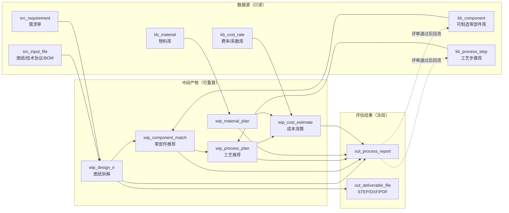

# AI 工艺评估平台 · 数据架构设计（DA v0.1）

> 状态：**已实现（SQLite）**。库文件 `data/da.db`，图库文件夹 `data/kb/`，建库入口
> `python scripts/init_da_db.py --seed`。实现清单与偏差见第 9 节。
> 既有的 `data/<project_id>/*.json` 流程未被改动，两者当前并存。

---

## 1. 设计原则

| 原则 | 说明 |
| --- | --- |
| **数据源与产出严格分离** | 数据源（Source / Knowledge）**只读、可复用、跨项目沉淀**；产出（Output）**只写一次、可重算、可追溯**。两者永不混在同一张表里。 |
| **可重算（Recomputable）** | 任何产出 = f(数据源快照, 参数, 模型版本)。产出表必须记录它引用的**数据源版本/快照**，否则 3 个月后无法解释报告里的数字。 |
| **AI 建议 ≠ 平台结论** | 模型产出落 `*_recommendation`（建议），人工确认后才写入 `*_plan / *_result`（结论）。确认动作带 `confirmed_by / confirmed_at`。这一分层已在现有 `models/material.py`、`models/manufacturing.py` 中成立，DA 只是把它表化。 |
| **结构化数据入表，文件入 Blob** | 图纸/模型/报告等文档以**文件夹 + 文件**形式存储，库里只存**路径 + 哈希 + 元数据**。 |
| **知识回流** | 项目产出（新零件、新工艺路线、实测工时/价格）经评审后**反哺知识库**，走单独的 promotion 通道，不允许项目直接写知识库。 |

### 分层与命名前缀

```
┌─────────────────────────────────────────────────────────────┐
│ L0  kb_*    知识库 / 主数据      —— 数据源（企业资产，跨项目）  │
│ L1  src_*   项目输入             —— 数据源（本次评估的原始输入）│
├─────────────────────────────────────────────────────────────┤
│ L2  wip_*   过程中间产物（IR）    —— 产出（可重算、可编辑）     │
│ L3  out_*   评估结果 / 交付物     —— 产出（冻结、可分发）       │
├─────────────────────────────────────────────────────────────┤
│ L4  ops_*   运行 / 审计 / 权限    —— 治理                     │
└─────────────────────────────────────────────────────────────┘
```

---

## 2. 三段主流程与数据流



**阶段 → 数据读写矩阵**

| 阶段 | 读（数据源） | 读/写（中间产物） | 写（产出） |
| --- | --- | --- | --- |
| 1. 接受工艺评估需求 | `src_input_file`, `src_requirement` | — | `src_requirement`（受理态） |
| 2.1 图纸拆解 | `src_input_file`, `kb_standard_part` | `wip_design_ir`, `wip_part`, `wip_part_feature` | `out_deliverable_file`(生成的 2D/3D) |
| 2.2 零部件推荐 | `kb_component`(+param/feature/drawing) | `wip_component_match` | — |
| 2.3 材料定性 | `kb_material`(+property/supplier) | `wip_material_plan` | — |
| 2.4 工艺推荐 | `kb_process_step`, `kb_process_route`, `kb_equipment` | `wip_process_plan`, `wip_route_step`, `wip_bom_item` | — |
| 2.5 成本测算 | `kb_material_price`, `kb_cost_rate`, `kb_cost_factor` | `wip_cost_estimate`, `wip_cost_item` | — |
| 3. 输出工艺评估结果 | — | 全部 wip_*（快照） | `out_process_report`, `out_report_*`, `out_deliverable_file` |

---

## 3. L0 知识库层：可制造零部件

> 这是「图纸拆解 → 零部件推荐」的**唯一检索底座**。核心诉求：一个零件被拆出来后，
> 能按「特征 + 参数 + 材料」找到库里已有的可制造件，判定 **复用 / 改制 / 新制**。

### 3.1 `kb_component` 可制造零部件主数据

| 字段 | 类型 | 说明 |
| --- | --- | --- |
| component_id | PK, uuid | |
| component_code | varchar, uniq | 企业物料编码，如 `CMP-BRK-0012` |
| name | varchar | 零部件名称 |
| category / subcategory | varchar | 分类树：结构件/回转件/钣金件/陶瓷基板/标准件… |
| source_type | enum | `self_made` 自制 / `outsourced` 外购 / `standard` 标准件 |
| spec_summary | text | 规格摘要（如「Q235 板 200×120×10，4-M8」） |
| default_material_code | FK→kb_material | 默认材料 |
| default_route_code | FK→kb_process_route | 默认工艺路线模板 |
| envelope_l / w / h | numeric | 外形包络（mm），用于粗筛 |
| mass_kg | numeric | 参考质量 |
| manufacturability | enum | `mature` 成熟 / `conditional` 有条件 / `hard` 难加工 |
| reuse_count | int | 被复用次数（推荐排序权重） |
| lifecycle | enum | `active` / `deprecated` / `draft` |
| owner / created_by / created_at / updated_at | | |
| rev | varchar | 当前有效版本号，与图纸版本联动 |

### 3.2 `kb_component_param` 零部件参数（EAV，可检索）

| 字段 | 类型 | 说明 |
| --- | --- | --- |
| param_id | PK | |
| component_id | FK | |
| param_key | varchar | `length` / `width` / `thickness` / `hole_diameter` / `tolerance_grade` … |
| param_name | varchar | 中文名 |
| value_num / value_text | numeric / varchar | 数值型走 value_num（可范围检索） |
| unit | varchar | mm / µm / ° / — |
| tol_lower / tol_upper | numeric | 允差，用于「参数近似匹配」 |
| is_key | bool | 关键参数（匹配时权重高） |

> **为什么 EAV**：不同品类零件参数集差异极大（陶瓷基板 vs 钣金件），宽表会退化成上百空列。
> 关键数值参数同时冗余到 `kb_component` 的包络字段做粗筛，EAV 只做精筛。

### 3.3 `kb_component_feature` 特征签名（对齐 `models/ir.py` 的 `Feature`）

| 字段 | 说明 |
| --- | --- |
| feature_id | PK |
| component_id | FK |
| feature_type | enum，**直接复用 `FeatureType`**：plate/box/cylinder/hole/hole_pattern/fillet/chamfer |
| length / width / thickness / height / diameter / radius / distance | numeric，mm |
| count_x / count_y / spacing_x / spacing_y | 孔阵列 |
| seq | int，建模顺序 |
| purpose | varchar |

> 拆解产出的 `wip_part_feature` 与本表**同构**，因此零部件推荐可以做「特征序列相似度」比对，
> 而不是只比名称字符串。

### 3.4 `kb_component_drawing` 图纸/模型文件索引（2D & 3D 图纸库）

| 字段 | 类型 | 说明 |
| --- | --- | --- |
| drawing_id | PK | |
| component_id | FK | |
| drawing_kind | enum | `2d` / `3d` / `doc`（规格书、检验规范、工艺卡） |
| file_format | enum | dwg, dxf, pdf, png / step, stp, stl, sldprt, x_t / docx, xlsx |
| rev | varchar | 图纸版本 A/B/C 或 V1.0 |
| is_current | bool | 当前有效版 |
| file_path | varchar | **相对 Blob 根路径**，见 §7 |
| file_sha256 | char(64) | 去重 + 完整性 |
| file_size | bigint | |
| thumbnail_path | varchar | 缩略图/预览 SVG |
| page_count | int | PDF/多页 |
| title_block | jsonb | 从标题栏提取的元信息（图号、比例、设计者、日期） |
| uploaded_by / uploaded_at | | |

### 3.5 `kb_component_embedding`（可选，语义检索）

`component_id, scope(name|spec|feature), model_name, dim, vector, built_at`
—— 用于「文本/特征向量召回 → 参数精筛」的两阶段推荐。初期可不建，用规则匹配跑通。

### 3.6 `kb_standard_part` 标准件库

`std_id, standard_no(GB/T 5783), designation(M8×25), category(bolt/nut/washer/bearing), size_params jsonb, material, surface_treatment, unit_price_ref, supplier_ref, drawing_path`
—— 对齐 `models/ir.py::StandardPart`，拆解阶段直接命中，不进入零件推荐流程。

---

## 4. L0 知识库层：工艺

### 4.1 `kb_process_step` 工艺步骤（工序原子）库

| 字段 | 类型 | 说明 |
| --- | --- | --- |
| step_code | PK, varchar | `PS-MILL-ROUGH` |
| name | varchar | 粗铣基准面 |
| process_type | enum | **复用 `models/process.py::ProcessType`**：blank/turning/milling/drilling/boring/grinding/bench/sheet_metal/welding/heat_treat/surface/assembly/inspection/other |
| category | varchar | 成型/共烧/机加工/金属化/检测（工艺域分类，兼容非机加场景） |
| description_tpl | text | 工序内容模板 |
| applicable_material | varchar[] | 适用材料类别 |
| applicable_feature | varchar[] | 适用特征类型（与 FeatureType 对齐 → 支持「特征→工序」自动推荐） |
| default_equipment_class | FK→kb_equipment_class | |
| default_fixture / default_tooling | varchar | |
| quality_items | jsonb | 默认检验项（平面度/Ra/尺寸公差） |
| setup_min | numeric | 标准准备工时（分钟/批） |
| unit_min_formula | text | 单件工时模型，如 `0.02*area_mm2 + 3`；平台侧确定性求值 |
| yield_rate | numeric | 典型良率 |
| is_critical | bool | 关键工序 |
| version / effective_from / status | | 工艺库须可版本化 |

### 4.2 `kb_process_param_template` 工序参数模板

`tpl_id, step_code FK, param_key(S/F/ap/温度/保温时长), param_name, default_value, min_value, max_value, unit, depends_on(材料/刀具/厚度), note`

### 4.3 `kb_process_route` / `kb_process_route_step` 典型工艺路线模板

- `kb_process_route`: `route_code PK, name, applicable_category, applicable_material, batch_range, summary, version, status`
- `kb_process_route_step`: `route_code FK, seq(10/20/30), step_code FK→kb_process_step, is_optional, condition_expr, depends_on int[], param_override jsonb`

> 工艺推荐 = 「按零件类别/材料召回 route 模板」→「按特征补挂 step」→「参数模板求值」→ 交模型润色 →
> 落 `wip_process_plan`。模板保证结论稳定，模型只负责补差异。

### 4.4 `kb_equipment` 设备资源库

| 字段 | 说明 |
| --- | --- |
| equipment_id PK / equipment_code | |
| name / model_no / manufacturer | 如 `CNC 加工中心 VMC850` |
| equipment_class | 与 `kb_process_step.default_equipment_class` 对应 |
| capability | jsonb：行程 X/Y/Z、最大工件重量、主轴转速、精度、炉温上限… |
| hourly_rate | 元/小时（人工+管理，含在 `kb_cost_rate` 也可，此处冗余为运行值） |
| depreciation_per_hour | 元/小时，设备折旧 |
| power_kw | 用于能耗成本 |
| workshop / status / count | 车间、可用状态、台数 |

> 已有 `data/equipment.json`，字段扩展后直接对应本表。

### 4.5 `kb_inspection_item` 检验项库（可选）

`insp_code, name, method, instrument, sampling_rule, acceptance_criteria, cost_per_item`

---

## 5. L0 知识库层：物料 & 成本基准

### 5.1 `kb_material` 物料主数据

| 字段 | 说明 |
| --- | --- |
| material_code PK | `MAT-Q235-PL` |
| name / grade | Q235 / 6061-T6 / 304 / Al2O3-96% / Ag-Pd 浆料 |
| category | 金属/陶瓷粉体/浆料/耗材辅料/包材 |
| form | 板材/棒材/粉末/浆料/型材 |
| spec | 规格描述（板厚系列、粒径区间） |
| density | g/cm³（对齐 `models/ir.py::Material.density`） |
| base_unit | kg / g / m² / 件 |
| standard_loss_rate | 标准损耗率，成本测算用 |
| hazard_level / storage_req | 危化/存储条件 |
| status / created_at | |

### 5.2 `kb_material_property` 物料性能（EAV）

`material_code FK, prop_key(thermal_conductivity/cte/dielectric/tensile/purity/d50), value_num, value_text, unit, test_method, source_ref`
—— 对齐 `models/material.py::BodyCandidate` 的热导率/介电/CTE/机械强度字段。

### 5.3 `kb_material_price` 物料价格（时间序列 · 成本测算基准）

| 字段 | 说明 |
| --- | --- |
| price_id PK | |
| material_code FK | |
| price / currency / unit | |
| price_type | `internal_purchase` 内部采购价 / `contract` 合同价 / `market` 市场行情 / `ai_web` 联网检索 |
| valid_from / valid_to | **有效期**，成本测算按测算日取价 |
| source_name / source_url / evidence | 可追溯，对齐 `models/cost.py::WebSource` |
| confidence | 0~1，AI 检索价需标注 |
| supplier_id | 可空 |

### 5.4 `kb_supplier` / `kb_supplier_capability`

- `kb_supplier`: `supplier_id, name, type(原材料/外协/外购件), region, qualification, rating, contact, note`（已有 `data/suppliers.json`）
- `kb_supplier_capability`: `supplier_id FK, material_code FK, max_purity_pct, d50_min_um, d50_max_um, moq, lead_time, price_ref, qualified`
  —— 对齐 `models/material.py::Supplier / SupplierMatch`，供应商达标判定由平台确定性计算。

### 5.5 `kb_cost_rate` 费率库

| 字段 | 说明 |
| --- | --- |
| rate_code PK | `RATE-LABOR-CNC` |
| rate_type | `labor` 人工 / `equipment_dep` 设备折旧 / `energy` 能耗 / `overhead` 管理分摊 / `logistics` 物流 / `warehouse` 仓储 / `packaging` |
| scope_type / scope_ref | 作用域：`global` / `workshop` / `equipment_class` / `process_type` |
| value / unit | 元/小时、元/kWh、元/kg·天、元/m³·km |
| effective_from / effective_to | 版本化 |
| source / approved_by | |

### 5.6 `kb_cost_factor` 计价系数库

`factor_code, factor_type(yield 良率 / scrap 损耗 / batch_amortize 批量分摊 / margin 毛利 / tax 税率 / fx 汇率 / risk 风险系数), applicable_scope, value, condition_expr, effective_from/to`

> **成本测算的可解释性完全依赖 5.3 + 5.5 + 5.6 三张表的「取值时点」**。
> 产出侧的 `wip_cost_item` 必须回填 `rate_code/price_id/factor_code` 与取值版本，
> 否则报告中的单价无法复现。

---

## 6. L1 项目输入层 / L2 中间产物 / L3 产出

### 6.1 `src_*` 项目输入（数据源侧）

| 表 | 关键字段 | 说明 |
| --- | --- | --- |
| `src_project` | project_id PK, project_no, name, customer, owner, status, stage, created_at, archived | 对齐 `data/<project_id>/meta.json` |
| `src_requirement` | requirement_no PK, project_id FK, title, status(draft→pending_confirmation→pending_review→approved/rejected), created_by/at, confirmed_by/at, reviewed_by/at, review_note | **对齐 `models/workflow.py::RequirementDoc`** |
| `src_requirement_field` | requirement_no FK, field_key, field_name, field_value, source(`human`/`ai_extract`), confidence | `RequirementDoc.data` 的表化，支持字段级留痕 |
| `src_input_file` | file_id PK, project_id FK, file_kind(`drawing_img`/`drawing_2d`/`model_3d`/`tech_doc`/`bom`/`contract`), filename, file_path, sha256, size, mime, page_count, uploaded_by/at | 原始图纸与附件索引 |
| `src_input_region` | region_id, file_id FK, page_no, bbox(numeric[4] 归一化), label | 供 `Provenance.bbox` 回指原图区域 |
| `src_external_evidence` | evidence_id, project_id, stage, query, url, title, snippet, retrieved_at, model_name | 联网检索/型号核验证据，对齐 `WebSource` 与 `models/model_lookup.py` |

### 6.2 `wip_*` 中间产物（产出侧，可重算可编辑）

| 表 | 关键字段 |
| --- | --- |
| `wip_design_ir` | ir_id PK, project_id, version, device_name, design_intent, overall_dims, assembly_notes, model_name, generated_at, confirmed_by/at |
| `wip_assembly` | ir_id FK, assembly_id, name, parent_id, role, quantity |
| `wip_part` | ir_id FK, part_id, name, parent_id, role, material_spec, tolerance_general, quantity, confidence, recommendation, model_no, manufacturer, model_specification, model_lookup_evidence |
| `wip_part_feature` | ir_id, part_id FK, seq, **与 `kb_component_feature` 同构** |
| `wip_part_provenance` | ir_id, part_id, file_id FK→src_input_file, bbox, note |
| `wip_standard_part` | ir_id, spec, category, quantity, matched_std_id FK→kb_standard_part |
| `wip_component_match` | match_id, ir_id, part_id, **component_id FK→kb_component**, match_type(`exact`/`param_near`/`feature_similar`/`none`), score, gap_notes, decision(`reuse` 复用/`modify` 改制/`new` 新制), decided_by/at |
| `wip_part_geometry` | ir_id, part_id, artifact_kind(`step`/`stl`/`dxf`/`svg_front`…), file_path, sha256, generated_at | 平台生成的 3D/2D，落 §7 的 `projects/<id>/geometry/` |
| `wip_material_plan` | project_id, body_selected, body_rationale, paste jsonb, layers jsonb, supply_conclusion, timing_status, confirmed_by/at | 对齐 `MaterialPlan` |
| `wip_material_candidate` | project_id, material_code FK→kb_material, score, pros, cons, recommended, source |
| `wip_process_plan` | plan_id, project_id, part_id, material, blank, summary, route_code FK→kb_process_route（来源模板）, confirmed_by/at |
| `wip_process_step` | plan_id FK, step_no(10/20/30), **step_code FK→kb_process_step**, name, type, description, equipment_id FK→kb_equipment, fixture, tooling, params, quality, duration_min, depends_on int[], confidence | 对齐 `models/process.py::ProcessStep`；`step_code` 为空 = 模型新造工序（知识回流候选） |
| `wip_route_step` | project_id, seq, name, category, equipment, params, purpose, quality, critical | 设备/整机级核心路径，对齐 `ManufacturingPlan.path` |
| `wip_bom_item` | project_id, ref, item, category(原材料/中间品/耗材辅料/工序产出), **material_code FK**, spec, quantity, unit, from_step |
| `wip_cost_estimate` | estimate_id, project_id, currency, batch_size, material_total, manufacturing_total, technical_total, logistics_total, grand_total, market_notes, confirmed_by/at, priced_at | 对齐 `models/costest.py::CostEstimate` |
| `wip_cost_item` | item_id, estimate_id FK, **cost_type**(`material`/`manufacturing`/`technical`/`logistics`), name, spec, unit_usage, unit, unit_price, amount, basis, **price_id FK→kb_material_price**, **rate_code FK→kb_cost_rate**, **factor_code FK→kb_cost_factor**, source(`ai`/`kb`/`human`), note | 四类成本合一张明细表，靠 cost_type 区分；**外键回指是可解释性的关键** |
| `wip_open_question` | q_id, project_id, stage, field, reason, guess, status(open/resolved), resolved_by/at | 全阶段统一澄清池，对齐 `OpenQuestion` |
| `wip_stage_state` | project_id, stage(2.1~2.6), status(not_started/in_progress/done), started_at, finished_at, confirmed_by/at | 对齐 `models/material.py::Timing` |

### 6.3 `out_*` 评估结果（冻结、可分发）

| 表 | 关键字段 |
| --- | --- |
| `out_process_report` | report_no PK, project_id, requirement_no FK, title, version, status(draft→in_review→approved/rejected→published), overview, conclusion, prepared_by/at, reviewed_by/at, published_by/at | 对齐 `models/workflow.py::ProcessReport` |
| `out_report_evaluation_item` | report_no FK, seq, item, status(可行/有条件可行/不可行), conclusion | `ReportEvaluationItem` |
| `out_report_stage_result` | report_no FK, stage, conclusion | `ReportStageResult` |
| `out_report_review` | report_no FK, seq, item, tag, opinion, reviewer, role, reviewed_at | `ReportReviewItem` + `WorkflowReview` |
| `out_report_attachment` | report_no FK, name, source_kind, ref_table, ref_id, file_path | 指向 wip 产物或交付文件 |
| `out_report_snapshot` | report_no FK, version, snapshot jsonb, snapshot_sha256, frozen_at | **冻结全部 wip_\* + 引用到的 kb 版本号**，保证报告永久可复现 |
| `out_deliverable_file` | deliverable_id, project_id, report_no, kind(`report_pdf`/`bom_xlsx`/`step`/`dxf`/`process_card`), file_path, sha256, generated_at | 对外交付物 |
| `out_report_distribution` | report_no FK, recipient_name, organization, contact, channel, sent_at, ack_at | `ReportRecipient` |
| `out_cost_result` | report_no FK, batch_size, unit_cost, total_cost, currency, margin, quoted_price, frozen_at | 对外成本结论（与可变的 wip_cost_estimate 解耦） |

### 6.4 `ops_*` 治理层

| 表 | 说明 |
| --- | --- |
| `ops_user` / `ops_role` / `ops_user_role` | 对齐 `services/auth.py` |
| `ops_task` | task_id, project_id, kind, status, progress, payload, error, started_at/finished_at（已有 `tasks.json`） |
| `ops_audit` | audit_id, project_id, actor, action, target, detail jsonb, at（已有 `audit.json`） |
| `ops_version` | project_id, stage, version, status, author, note, payload_ref（已有 `versioning.py`） |
| `ops_llm_call` | call_id, project_id, stage, provider(claude/qwen/openai), model, prompt_sha256, input_tokens, output_tokens, cost, latency_ms, ok, at | **AI 产出的可追溯凭证**，报告里每条 AI 结论都能回到具体一次调用 |
| `ops_kb_promotion` | promo_id, source_table, source_id, target_kb_table, status(pending/approved/rejected), reviewer, decided_at | 知识回流通道 |
| `ops_kb_change_log` | kb_table, kb_id, field, old_value, new_value, actor, at | 知识库变更留痕 |

---

## 7. 文件（Blob）目录规范

图纸/模型/文档一律以**文件夹 + 文件**存储，库表只存 `file_path`（相对根）与 `sha256`。

```
blob_root/
├── kb/                                   # 知识库资产（跨项目、只增不改，改则升 rev）
│   ├── components/<component_code>/
│   │   ├── 2d/<rev>/            *.dxf *.dwg *.pdf        ← 2D 图纸库
│   │   ├── 3d/<rev>/            *.step *.stp *.stl *.sldprt ← 3D 模型库
│   │   ├── doc/<rev>/           规格书.pdf 检验规范.docx 工艺卡.pdf
│   │   └── thumb/               preview.svg preview.png
│   ├── standard_parts/<standard_no>/<designation>/  2d/ 3d/
│   ├── materials/<material_code>/        MSDS.pdf 检测报告.pdf 性能曲线.png
│   └── routes/<route_code>/              工艺路线卡.pdf
│
└── <project_id>/                         # 项目数据（输入 + 产出，物理分开）
    │                                     # 实现沿用现有 data/<project_id>/，不加 projects/ 一层，
    │                                     # 以免改动既有读写路径；kb/ 与项目目录(12 位 hex)不冲突
    ├── input/                            ← 数据源：原始上传，只读、永不覆盖
    │   ├── source.png                    原始设备图
    │   └── attachments/                  技术协议、BOM、客户附件
    ├── ir/                               ← 产出：IR 快照（按 version 归档）
    │   └── v<n>/design_ir.json
    ├── geometry/<part_id>/               ← 产出：平台生成的 2D/3D
    │   ├── model.step  model.stl  flat.dxf
    │   └── views/ iso.svg front.svg top.svg right.svg
    ├── stage/                            ← 产出：各阶段中间结果
    │   ├── material.json manufacturing.json process/<part_id>.json costest.json
    └── report/<report_no>/               ← 产出：评估结果
        ├── v<n>/report.json  report.pdf
        └── attachments/ bom.xlsx 工艺卡.pdf
```

规则：
1. `input/` 与其余目录**权限分离**：`input/` 上传后只读；产出目录允许被重算覆盖（覆盖前写 `ops_version`）。
2. 文件名不含中文与空格（现有 `samples/ChatGPT Image ....png` 这类需在入库时规范化），原名存 `src_input_file.filename`。
3. 同一 `sha256` 在 `kb/` 下只存一份，多个 component 引用同一文件时表里多行、路径同一。
4. 报告发布时把引用到的文件**复制**（非软链）到 `report/<report_no>/v<n>/`，保证发布版不受后续重算影响。

---

## 8. 关键设计决策

### 8.1 零部件推荐的匹配策略（决定了 §3 的表结构）

三级漏斗，全部可离线跑、不依赖模型：

1. **粗筛**：`kb_component` 按 category + 材料 + 包络尺寸（±20%）范围查询。
2. **精筛**：`kb_component_param` 关键参数逐项比对，落在 `tol_lower/tol_upper` 内计满分，超出按偏差衰减。
3. **特征相似**：`wip_part_feature` vs `kb_component_feature` 做序列比对（类型集合 Jaccard + 尺寸归一化距离）。

结果写 `wip_component_match.score`，`decision` 由人工在界面上定。**模型只用于解释匹配结果与给改制建议，不参与打分**——否则分数不可复现。

### 8.2 为什么成本明细是一张表 + `cost_type`

`models/costest.py` 里材料/制造/技术/物流四类是四个独立 List，字段高度重合（basis/amount/note）。
建表时合一张 `wip_cost_item`，好处：合计口径唯一、跨类目排序/占比分析一句 SQL、新增第五类成本不动表结构。
差异字段（`unit_usage/unit_price` 只有材料有；`labor_cost/equipment_depreciation/energy_cost` 只有制造有）
放 `detail jsonb`，或按当前 Pydantic 字段全列展开、允许为空——初期建议**全列展开**，可读性优先。

### 8.3 版本与快照

- **知识库**：`kb_process_step` / `kb_process_route` / `kb_cost_rate` / `kb_material_price` 全部带
  `version` + `effective_from/to`，**永不物理更新**，改动即新增一行。
- **项目产出**：每次重算写 `ops_version`，旧版保留在 `ir/v<n>/`、`report/v<n>/`。
- **报告冻结**：`out_report_snapshot.snapshot` 存整份 JSON + 引用到的 kb 行版本号列表。
  这是「三个月后客户质疑单价」时唯一能自证的东西。

### 8.4 ID / 编码规范

| 对象 | 规则 | 示例 |
| --- | --- | --- |
| project_id | 12 位 hex（沿用现状） | `25f202f3ed4d` |
| requirement_no | `REQ-YYYYMM-####` | `REQ-202608-0007` |
| report_no | `RPT-YYYYMM-####` | `RPT-202608-0007` |
| component_code | `CMP-<品类3位>-####` | `CMP-BRK-0012` |
| material_code | `MAT-<类别>-<牌号>` | `MAT-STL-Q235` |
| step_code | `PS-<工艺>-<细分>` | `PS-MILL-ROUGH` |
| part_id / assembly_id | 项目内序号（沿用 IR） | `P-001` / `A-001` |

---

## 9. 落地路径：从现有 JSON 到目标 DA

### 9.1 实现清单（SQLite）

| 文件 | 作用 |
| --- | --- |
| `backend/storage/da_schema.sql` | 全部 63 张表的 DDL（kb 20 / src 6 / wip 18 / out 9 / ops 9 + schema_meta）。文档里的表结构与库里的建表语句是同一份文本，不存在 ORM 映射漂移 |
| `backend/storage/da_db.py` | 连接（WAL / `foreign_keys=ON` / 线程内复用）、建库、`query/execute/upsert` 等 helper |
| `backend/storage/kb_library.py` | 图库文件夹布局、文件名规范化、写入与**扫描登记** |
| `backend/storage/kb_repo.py` | 知识库读写 + 零部件推荐三级漏斗 + 按时点取价/取费率 + 供应商达标判定 |
| `backend/storage/da_repo.py` | 项目侧 `src_*/wip_*/out_*/ops_*` 读写：IR 落表与回读、成本重算、报告冻结、知识回流 |
| `backend/storage/da_seed.py` | 知识库种子：10 设备类别 / 5 设备 / 12 工序 / 3 条路线 / 5 物料+价格 / 7 费率 / 4 系数 / 2 供应商 / 4 标准件 / 2 示例零部件 |
| `scripts/init_da_db.py` | 建库 CLI：`--seed` 种子、`--scan` 扫描图库、`--import-legacy` 导入既有 JSON、`--stats` 行数统计 |
| `tests/test_da_db.py` | 27 项离线回归：外键/CHECK 生效、图库扫描与改版、推荐可复现、取价时点、成本重算、快照冻结 |

配置项（`backend/config.py`）：`DA_DB_PATH`（默认 `data/da.db`）、`KB_DIR`（默认 `data/kb`）。
`data/` 已在 `.gitignore` 中，库与图库不进仓库，**部署时需执行一次建库命令**。

```bash
python scripts/init_da_db.py --seed          # 建库 + 图库骨架 + 种子数据
python scripts/init_da_db.py --scan          # 把手工拷进文件夹的图纸登记进索引
python scripts/init_da_db.py --stats         # 查看各表行数
```

### 9.2 与设计稿的三处偏差

1. **图库以文件夹为准，库表只是索引**。`sync_component_drawings()` 扫描目录：新文件登记、
   删掉的文件从索引移除、最新版本目录自动标 `is_current`。工艺人员可以直接拷文件进去，
   不必先在系统里建记录——图库在没有平台的情况下依然可用。
2. **项目目录不加 `projects/` 一层**，沿用现有 `data/<project_id>/`，避免改动既有读写路径。
3. **`kb_equipment_class` 是新增表**：设计稿里 `kb_process_step.default_equipment_class` 指向一个
   未定义的表，实现时补上了这个挂载点。

### 9.3 已实现 vs 仍待接线

| 目标层 | 状态 |
| --- | --- |
| `kb_component` 全套 + 2D/3D 图纸库 | ✅ 表 + 文件夹 + 扫描登记 + 三级漏斗推荐 |
| `kb_process_step` / `kb_process_route` | ✅ 表 + 种子 + 「特征→工序」召回 + 路线模板展开 |
| `kb_material` / `kb_material_price` | ✅ 表 + 种子 + 按时点取价 |
| `kb_cost_rate` / `kb_cost_factor` | ✅ 表 + 种子 + 作用域回退（专用费率缺失时回落 global） |
| `kb_equipment` / `kb_supplier` | ✅ 表 + `--import-legacy` 从既有 JSON 导入 |
| `src_*` / `wip_*` / `out_*` / `ops_*` | ✅ 表 + `da_repo` 读写函数（含成本重算、报告冻结、知识回流） |
| **接入 `backend/main.py` 的接口与前端** | ❌ **未做**。现有流程仍走 `storage/store.py` 的 JSON 落盘，DA 库目前是并行的、可独立调用的一层 |
| 从现有 `data/<project_id>/*.json` 回灌历史项目 | ❌ 未做，需要一次性迁移脚本 |

### 9.4 下一步建议顺序

1. **成本测算改接 DA**：`services/costest.py` 改成「模型只给用量与工序 → 平台查 `kb_material_price` /
   `kb_cost_rate` 算钱 → `da_repo.save_cost_estimate` 重算合计」。这是收益最大的一步，
   金额从「模型编的」变成「可复现的」。
2. **零部件推荐接入 2.2 页面**：`kb_repo.recommend_components()` + `da_repo.save_component_matches()`，
   人工在界面上定 复用/改制/新制。
3. **工艺推荐接模板**：先用 `recommend_routes()` 出骨架，再让模型补差异，落 `wip_process_step.step_code`。
4. **报告发布调 `freeze_report()`**，补齐可追溯性。
5. 历史项目回灌脚本 + `ops_llm_call` 在 `services/*_client.py` 里埋点。


---

## 10. 源表模拟数据（半导体 / 电池 / 电器）

> 实现:`backend/storage/da_mock.py`;写入命令 `python scripts/init_da_db.py --mock`（或 `--mock battery` 单选）。

### 10.1 范围：只造源表

| 层 | 是否有模拟数据 | 原因 |
| --- | --- | --- |
| `kb_*` 知识库 | ✅ 三行业各一套 | 这是企业存量资产，评估开始前就该存在 |
| `src_*` 项目输入 | ✅ 每行业一份评估需求 | 对应「接受工艺评估需求」这一步的入口数据 |
| `wip_*` 中间产物 | ❌ 空 | 必须由平台跑一遍算出来 |
| `out_*` 评估结果 | ❌ 空 | 预置结论等于伪造评估报告，事后无法分辨哪些数字是真算的 |

### 10.2 三行业数据量

| 行业 | 物料 | 价格 | 工序 | 路线 | 零部件 | 设备 | 供应商 | 费率/系数 | 评估需求 |
| --- | --- | --- | --- | --- | --- | --- | --- | --- | --- |
| 半导体 | 9 | 11 | 16 | 2 | 3 | 11 | 4 | 5 / 4 | 1 |
| 电池 | 9 | 11 | 13 | 2 | 3 | 9 | 5 | 6 / 4 | 1 |
| 电器 | 8 | 9 | 13 | 2 | 4 | 10 | 4 | 7 / 4 | 1 |

- **半导体**：硅片/光刻胶/靶材/EMC/金线/AlN 基板；前道 `RT-SEMI-FEOL`（清洗→氧化→光刻→刻蚀→注入→退火→沉积→金属化→CMP→CP）与后道 `RT-SEMI-PKG-QFN`；零部件含 QFN48 引线框架、AlN 功率模块基板、刻蚀腔体法兰。
- **电池**：LFP/NCM811/石墨/隔膜/电解液/铜箔铝箔；`RT-BAT-PRISMATIC`（叠片）与 `RT-BAT-CYLINDRICAL`（卷绕）两条可对比路线；零部件含方形铝壳、顶盖组件、模组汇流排。
- **电器**：ABS/HIPS/VCM 板/发泡料/漆包线/硅钢；`RT-APP-REFRIGERATOR`（内胆与外壳并行汇入发泡）与 `RT-APP-MOTOR`；零部件含冰箱内胆、VCM 门体面板、压缩机支架、定子铁芯。

### 10.3 数据里刻意埋的四个「真实世界特征」

1. **价格随时点变化**：金线涨价（620→685 元/g）、LFP 降价（42→38.5 元/kg）、ABS 随行情上浮。用来验证成本测算取的是**测算日**的价格，而不是随手取一条。
2. **供应商未通过认证**：国产 KrF 光刻胶供方规格达标但 `qualified=0`。用来验证达标判定不会只看参数。
3. **工序级费率**：洁净室分摊 320 元/h、涂布烘箱能耗 171.6 元/h、家电模具摊销 26 元/h。这三项按全局费率粗估都会严重失真。
4. **并行工艺依赖**：冰箱发泡 `depends_on: [10, 30]`，同时依赖吸塑内胆与折弯外壳两条支路。

### 10.4 造数据时暴露并修掉的三个实现缺陷

| 缺陷 | 现象 | 修复 |
| --- | --- | --- |
| `current_price` 排序把可信度排在时效前面 | 年初 confidence=1.0 的合同价永远盖住半年后的最新行情，材料涨跌反映不到测算里 | 改为 `valid_from DESC, confidence DESC`；要锁定某类价格显式传 `price_type` |
| `match_suppliers` 丢弃供应商自身认证状态 | 只按参数算 gap，未通过来料认证的供方被判为合格 | 认证未通过直接计入 gap，规格再达标也不算合格供方 |
| 包络粗筛一维超差即淘汰 | 钣金件库内记的是成形后包络（高 45mm），拆解给的是展开料厚（2mm），必然对不上而被误杀 | 改为**两维及以上**超差才淘汰；只差一维的放行并对该维计 0 分——那恰是「要不要折弯」的改制判断 |

> 这三条都是模拟数据带出来的：通用机加工种子数据的量级太整齐，掩盖了这些边界。

### 10.5 数据性质声明

模拟值取自公开行业常识范围内的**合理量级**，不对应任何企业的真实报价、良率或工艺参数，仅用于跑通链路与演示。
真实数据须由工艺/采购部门导入后覆盖（`--overwrite`）。


---

## 11. 行业模板：AI 自动生成 → 电器行业

起始页原有三个入口：半导体、电池、**AI 自动生成**（内部键 `flexible`，字段由模型读需求文档动态生成）。
本次把第三个入口换成**电器行业**，并配套一套固定的 Section C 字段。

### 11.1 单一事实源

同一套字段定义原先散在四处（表单 JS、AI 抽取字段集、PDF 章节、完整性检查），加行业必然漂移。
现在统一到 `backend/services/industry_templates.py`：

| 使用方 | 用途 |
| --- | --- |
| `frontend/requirement-create.js` 的 `RC_*_SPECS` | 表单渲染（键名/顺序/必填/中文名必须与 Python 一致） |
| `services/requirement_extract.py` | AI 可抽取字段集、必填推荐字段集、下拉枚举白名单 |
| `services/requirement_pdf.py` | 需求单 PDF 的「三、产品技术规格」章节 |
| `main.py::_requirement_precheck` | 需求完整性检查的章节与必填项 |

`tests/test_industry_templates.py` 直接解析前端 JS 的 `RC_*_SPECS`，逐项比对键名、顺序、必填标记、
中文名与下拉选项，两边一旦跑偏立即失败。

### 11.2 电器行业 Section C 字段（23 项）

| 块 | 字段 |
| --- | --- |
| 3.1 整机基础参数 | 产品品类\*、产品型号、额定电压/频率\*、额定功率\*、能效等级\*、整机外形尺寸、整机净重 |
| 3.2 性能与可靠性参数 | 关键性能指标\*、噪声限值、待机功耗、工作环境温度、整机使用寿命、可靠性试验要求 |
| 3.3 结构与材料 | 主体结构材料\*、外观表面工艺、保温与密封要求、核心部件\*、关键成型工艺\* |
| 3.4 安规与认证 | 安规标准\*、耐压测试要求、接地电阻要求、EMC 要求、认证区域 |

（\* 为必填。图纸与技术资料块顺延为 3.5，与电池模板一致。）

选型思路：半导体模板看精度（TTV/Ra/微孔）、电池看电性能（容量/内阻/循环），
**电器看的是「能效 + 安规认证 + 成型工艺」** —— 这三项决定整机能不能上市、成本落在哪里，
也正好对上知识库里电器行业那套物料（VCM 板/发泡料/硅钢）与工序（注塑/冲压/发泡/安规测试）。

### 11.3 数据库侧改动

1. **`src_requirement.industry` 新增列**（schema v2，`CHECK IN ('semiconductor','battery','appliance','flexible')`）。
   行业模板是需求单的结构性属性——它决定 Section C 有哪些字段，也决定后续各阶段该到知识库的
   哪一套物料/工序/费率里检索——所以单独成列，而不是混在 `src_requirement_field` 里当业务字段。
   新增 `da_repo.project_industry(project_id)` 供下游按行业限定检索范围。
2. **加列迁移**：`da_db._ADDED_COLUMNS` + `_add_missing_columns()`。`CREATE TABLE IF NOT EXISTS`
   不会给已建库补列，`init_db()` 现在会幂等地 `ALTER TABLE ADD COLUMN`。
3. **`src_requirement_field` 改用真实表单键**：三个行业的模拟需求单原先用中文键（"产品名称"、"年需求量"），
   现已全部换成表单实际使用的英文键（`appliance_category`、`annual_forecast`…），
   下拉/标签字段存的是选项 value（`refrigerator`、`vcm`、`GB 4706.1,CCC`）而非随手写的中文。
4. **保存时清理历史残留字段行**：需求单每次保存都带全量字段，不在本次数据里的行是改模板/换行业留下的，
   必须删掉，否则字段表会同时留着新旧两套键（本次迁移就清掉了 8 行中文键残留）。
5. 结构性键（`industry`、`industry_selection`、`industry_assessment`、`template_spec_manager`）
   不再落进字段表——它们描述「表单怎么渲染」，不是业务内容。

### 11.4 顺手修掉的三处既有缺陷

| 缺陷 | 影响 |
| --- | --- |
| PDF「三、产品技术规格」写死半导体字段 | **电池需求单的 Section C 在 PDF 里整章空白**，已改为按行业模板取字段 |
| 电池模板 4 个字段后端按必填校验、表单却无星号 | 用户不知道要填，到 1.2 确认才被拦；已在表单补上必填标记 |
| `mesa_height` / `battery_process_other` 前后端中文名不一致 | PDF 与页面显示两个名字；已统一 |

### 11.5 `flexible` 的处置

「AI 自动生成」从**可选项**中移除（首页与创建页的下拉都不再出现），但代码路径保留：
早期草稿的 `data.industry === 'flexible'` 仍能正常打开、渲染动态字段、生成 PDF、通过完整性检查。
行业分类提示词已改为只输出三个受支持行业，依据不足时选最接近的一个并把置信度压到 0.4 以下交人工改选，
不再有「兜底到 flexible」这条路。
